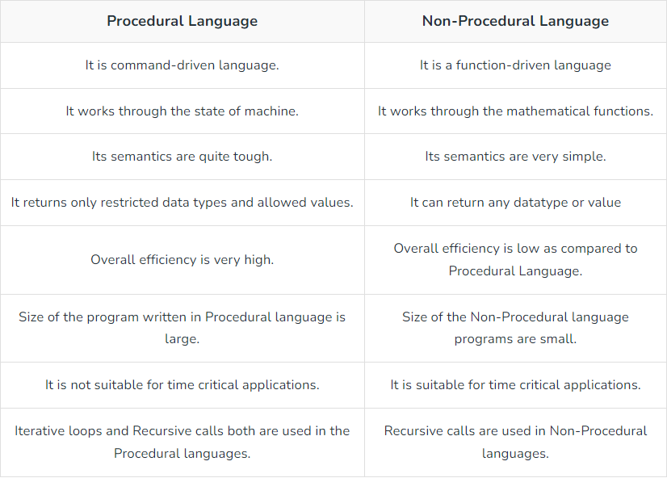

# C programming language: basics

## History of C

- developed by Dennis Ritchie in 1972
- developed as a system programming language to write the UNIX operating system

### Standards

C have several standard versions
- C89/C90, C99, C11, and C18

## Features

C is suitable for system programming like an operating system or compiler development

1. Procedural Language

procedural language: languages that writes program codes as a sequence of instructions
ex) FORTRAN, COBOL, ALGOL, BASIC, C and Pascal



- may contain more than one function to perform a particular task

2. Fast and Efficient

- provides access to direct manipulation with the computer hardware
- fast; statically typed

3. Modularity

modularity: storing C programming language code in the form of libraries for further future uses

4. Statically Type

typed language:
- languages that define the type of data type
- it will be known by machine at the compile-time or at runtime

	1. Statically typed languages
		- C, C++, Java,
		- data type of a variable is known at the compile time
		- programmer has to specify the data type of a variable at the time of its declaration
		- pre-define the return type of function, parameters
	2. Dynamically typed languages
		- JavaScript, Python, Ruby, Perl
		- do not require any pre-defined data type
		- interpreted at runtime by the machine itself
		- interpreters assign the data type to a variable at runtime depending on its value

5. General-Purpose Language

- used in various applications
- Operating systems: Windows, Linux, iOS, Android, OXS
- Databases: PostgreSQL, Oracle, MySQL, MS SQL Server, etc.

6. Rich set of built-in Operators

operator: symbols that represent operations to be performed on one or more operands

- can be defined as the symbols at C
- mathematical, relational, bitwise, conditional, or logical computations


7. Libraries with Rich Functions

8. Middle-Level Language

middle-level language:
- combined form of both capabilities of assembly language and features of the high-level language
- Java, C++, C, FORTH, Macro-assemble

[more about middle-level language](https://www.techopedia.com/definition/20789/medium-level-language-mll)

9. Portability

-  can run and compile on any system with either no or small changes

10. Easy to Extend

- extendable == when a program is already written in it then some more features and operations can be added to it

## Advantages & Disadvantages

### advantages

- Efficiency: can be used to create high-performance applications
- Portability: compiled and run on a wide range of platforms and operating systems
- Low-level access: Cideal for systems programming and developing operating systems
- Large user community: there are many resources and libraries available
- Widely used: many modern programming languages are built on top of it

### disadvantages

- Steep learning curve: complex syntax and low-level access to system resources
- Lack of memory management: does not provide automatic memory management; memory leaks and memory-related bugs
- No built-in support for object-oriented programming: difficult to write object-oriented code
- No built-in support for concurrency: difficult to write multithreaded applications
- Security vulnerabilities: prone to security vulnerabilities, such as buffer overflows

## Basic syntax

example code looks like this;

``` c
#include <stdio.h>
int main() {
	char c[] = "hello c";
	printf("%s", c);
	return 0;
}
```

### Header file inclusion

`#include <stdio.h>`

- header file is a file with extension `.h`
- contains C function declarations and macro definitions
- lines that start with # are processed by a preprocessor which is a program invoked by the compiler

### main() Declaration

`int main(){}`

- entry point of the C program
- execution typically begins with the first line of the main()
- doesn't have parameter

### Return

`int main(){}`
`return 0;`

- default return type of the main function is int
- main() function returns 0 after the successful execution

## References

[geeksforgeeks: c programming language tutorial](https://www.geeksforgeeks.org/c-programming-language/?ref=lbp)