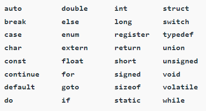

# C programming language: basics2

## Compile

Compilation: process of converting the source code of the C language into machine code

GCC compiler:
- GCC: GNU Compiler Collection; de facto standard
- GNU: GNU¡¯s not UNIX
- by compile sequence, executable file of the C program will be generated
- if errors are present, compile will fail

### Sequence

1. pre-processing

- Removal of Comments
- Expansion of Macros
- Expansion of the included files.
- Conditional compilation

2. compiling

- compile `filename.i` and produce an intermediate compiled output; file `filename.s`
- `filename.s` is assembly-level instructions

3. Assembling

- assembler take `filename.s` as input and turned into `filename.o`
- `filename.o` contains machine-level instructions
- only existing code is converted into machine language
- function calls like printf() are not resolved

4. Linking

- linking of function calls with their definitions is done
- linker adds some extra code which is required when the program starts and ends

## Comment

Comments in C:
- human-readable explanations or notes in the source code of a C program
- not executed by the compiler or an interpreter

Usage:
- make code more readable
- make code understandable; include a description
- prevent the execution of some parts of the code

### Types

1. single-line

`// single-line comment`

- extends till the end of the line
- don't need to specify end

2. multi-line

`/* multi-line comment */`

## Token

Token:
- basic component of a C program
- smallest individual element of the C programming language that is meaningful to the compiler

### Types

1. Keywords

- pre-defined or reserved words
- meant to perform a specific function in a program
- cannot redefine



more instructions below

2. Identifiers

- general terminology for the naming of variables, functions, and arrays
- user-defined name
- once declared, can use in later program statements to refer to the associated value
- statement label can be used in goto statements

Naming rules:
- must begin with a letter or underscore(_).
- must consist of only letters, digits, or underscore
- special character is not allowed(except underscore)
- should not be a keyword.
- must not contain white space(' ')
- should be up to 31 characters long as only the first 31 characters are significant

3. Constants

- fixed values
- cannot be modified once defined

4. Strings

- array of characters
- end with a null character `'\0'`
- enclosed in double quotes

5. Special Symbols

- have special meaning, cannot be used for other purpose

	1. Brackets `[]`: Used as array element references. Indicate single and multidimensional subscripts.
	2. Parentheses `()`: Used to indicate function calls and function parameters.
	3. Braces `{}`: Mark the start and end of a block of code containing more than one executable statement.
	4. Comma `,`: Used to separate more than one statement. (ex. separating parameters in function calls)
	5. Colon `:`: Operator that essentially invokes something called an initialization list.
	6. Semicolon `;`: Statement terminator.  Indicates the end of one logical entity.
	7. Asterisk `*`: Used to create a pointer variable and for the multiplication of variables.
	8. Assignment operator `=`: Used to assign values and for logical operation validation.
	9. Pre-processor Macro processor that is used automatically by the compiler to transform program before actual compilation.
	10. Period `.`: Used to access members of a structure or union.
	11. Tilde `~`: Used as a destructor to free some space from memory.

6. Operators

- symbols that trigger an action when applied to C variables and other objects
- data items on which operators act are called operands

	1. Unary Operators: Require only a single operand.
	2. Binary Operators: Require two operands.
		- Arithmetic operators
		- Relational Operators
		- Logical Operators
		- Assignment Operators
		- Bitwise Operator
	3. Ternary Operator: Requires three operands.


## Keyword

: pre-defined or reserved words that meant to perform a specific function in a program, cannot redefine


1. auto

```c
int sum(){
	auto int a = 10;
	auto int b = 11;
	return a + b;
}
```

- default storage class variable
- only accessed within the declared function/block
- `auto variable =  local variables`: have garbage values assigned

2. enum

```c
enum week{Mon, Tue, Wed, Thur, Fri, Sat, Sun};

void today(){
	enum week day;
	day = Wed;
}
```

- user-defined datatype; holds a list of user-defined integer constants
- value of each constant is it¡¯s index

3. extern

- declare a variable or a function that has an external linkage outside of the file declaration

4. goto

```c
goto label;

// code

label:
```

- used to transfer the control of the program to the given label
-  jump from anywhere to anywhere within a function

5. sizeOf

`sizeof(expression);`

- gets the size of an expression in bytes
- available in variables, arrays, pointers, etc

6. register

- tell the compiler to store variables in the CPU register instead of memory
- used at frequently used variables for faster access

7. const v.s static

const: 
- variable who¡¯s value cannot be changed

static:
- not limited by a scope and can be used throughout the program
- value is preserved even after it¡¯s scope
- scope: part of a code where a variable or a function is accessible

8. struct 

```c
struct student {
    char name[50];
    long id;
    int grade;
};
```

- used to declare a structure
- structure: list of variables which are grouped together under one data type

9. typedef

```c
typedef unsigned int number;
 
number num = 0;
```

- used to define a data type with a new name in the program
- can be used at structure

10. union

```c
union person {
    int age;
    char nationality[20];
}
```

- user-defined data type
- all data members which are declared under the union keyword share the same memory location
- can use data member one at a time above all data members

11. volatile

- volatile objects are omitted from optimization; their values can be changed by code outside the scope of the current code at any point in time
- even if they are declared as constant, hardware can change it as they are volatile objects