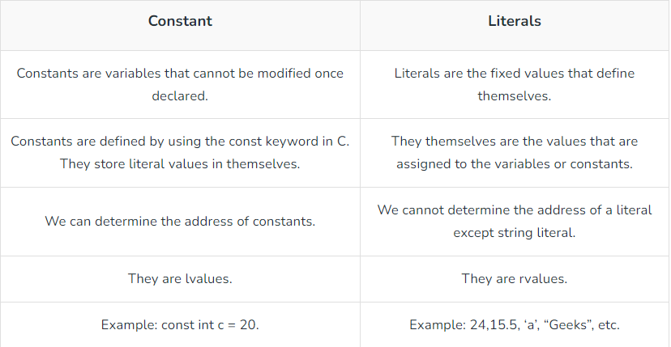

# C programming language: constant

## Constant

`const type name = value;`

- read-only variable whose value cannot be modified once it is defined
- have immutable value
- must initialize at the definition cannot modify after defining


Defining using #define Preprocessor:

`#define name value;`

- constants defined using `#define` are macros that behave like a constant
- these constants are not handled by the compiler but by the preprocessor; replaced by their value before complication

### Types

1. Integer Constant
2. Character Constant
3. Floating Point Constant
4. Double Precision Floating Point Constant
5. Array Constant
6. Structure Constant

### Properties

1. Initialized when Declared

- only initialize at the time of its declaration
- if not, store the garbage value

2. Immutability

- immutable after its definition



### Const Qualifier

`const`

used to declare specify variable which value will not be changed

- may change the value of the const variable by using a pointer

```c
void changeValueOfConstant() {
	const int i = 0;
	int* ptr = &i;
	printf("value of i = %d \n", i); // value of i = 0

	*ptr = 10;
	printf("value of i = %d", i); // value of i = 10
}
```

#### Pointer to Constant

`const type *ptr = value;`

points address of const variable

```c
int i = 0;
int j = 1;
const int *ptr = &i;
```

1. change `ptr`

`ptr = &j;`

Possible.

- `ptr` itself is not constant
- can change the pointer to point to any other integer variable

2. change `*ptr`

`*ptr = 100;`

Impossible.

- value is treated as constant when accessed through a const identifier
- cannot change because the value of `*ptr` is treated as constant

3. change `i`

`i = 10;`

Possible.

- `i` is not constant

#### Constant Pointer

`int *const ptr;`

declare pointer value to an integer constant

```c
int i = 0;
int j = 1;
int *const ptr = &i;
```

1. change `ptr`

`ptr = &j;`

Impossible.

- `ptr` is constant

2. change `*ptr`

`*ptr = 10;`

Possible.

- value of `*ptr` is not constant

#### Constant pointer to constant

`const int *const ptr = &variable;`

- cannot change the variable `ptr` is pointing
- cannot change the value of `*ptr`


#### `*` in C

1. between type and name

```c
type* name = &variable;
type * name = &variable;`
type *name = &variable;`
```

- declare as a pointer variable
- destination of `*` is irrelavant
- `&` means the address of the following variable

2. front of the pointer variable name

`*name = value;`

- dereference a pointer variable
- `dereference`: reading value by address

```c
type variable = initialValue;
type *pointer = &variable;
*pointer = newValue; // now the value of variable is newValue
```

- dereferencing updates the value of variable that the pointer is pointing at

3. operator

`2 * 3 == 6`

- used for mutiplication